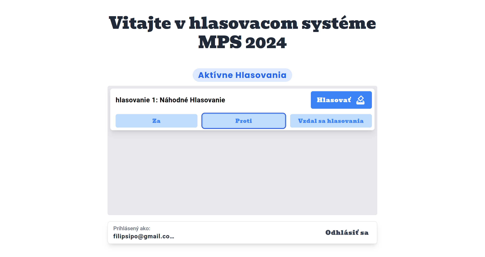
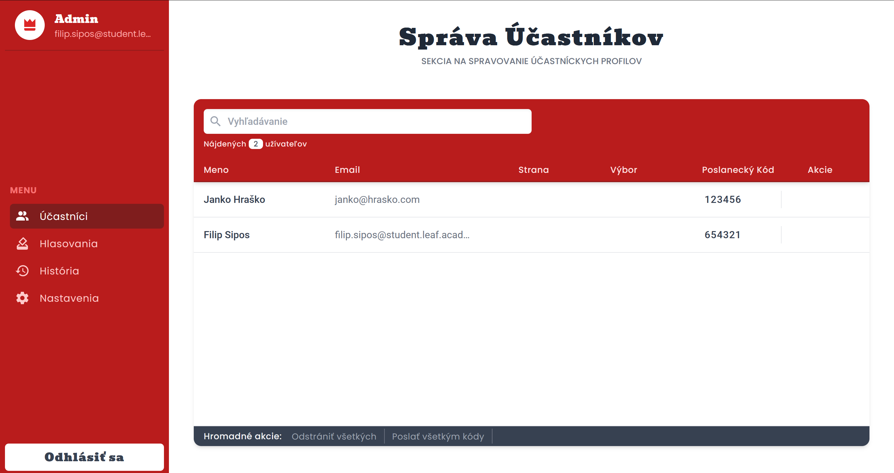

# [OUT OF SERVICE] Frontend for the Model Parliament of Slovakia Management System

[](https://mps-voting-system.web.app/)  

## Project Description

A system for management of the largest model conference in Slovakia - MPS. The web application serves several purposes, including real-time voting in the parliament, management of users, sending emails and more!

Currently, the web application is being developed and maintained by a single developer - which happens to be myself 😅. I will be very thankful for any and all suggestions and PRs, as I am still learning all the best practices and tricks of coding.

### MPS - Model Parliament of Slovakia

The Model Parliament of Slovakia (MPS) is an annual conference designed for high school students, aimed at fostering understanding and awareness of political processes and democratic principles. Since its inception, the conference has successfully taken place three times, attracting 150+ highschool students each year.

The MPS provides an immersive, hands-on experience where students can engage in realistic parliamentary procedures, debate current issues, and develop critical thinking and public speaking skills. Participants assume the roles of parliament members, crafting and discussing legislative proposals, gaining practical insights into the workings of a democratic government.

### Key Implemented Features (✅) and main TODOs (🔲)

✅ Login system for attendees based on parliamentary codes

✅ Integrated interface for attendee voting

✅ Admin interface for creation of polls

✅ Admin interface for management of users in the Firebase database

✅ Admin functionalities like sending emails, reseting passwords etc.

✅ Localization

✅ Interface for evaluation of users

✅ Separate interface for overlooking committees

✅ Proper security measures

🔲 Admin SDK Node.js server for handling admin requests

### Usage

As of now, there are two interfaces available in the application:

#### Attendee


The attendee interface is designed for all attendees of the conference, and allows each user to vote in polls created in the admin interface.

#### Admin



The admin interface is designed for management of users, committees, and polls themselves.

## Development

In case you would like to contribute to the project, following are some basic setup rules, that could be useful for you. As I've already mentioned, I will be super thankful for any support or feedback on the code and/or design.

### Recommended IDE Setup

- Editor: [VS Code](https://code.visualstudio.com/)
- Plugins: [Vue - Official](https://marketplace.visualstudio.com/items?itemName=Vue.volar) + [Better Comments](https://marketplace.visualstudio.com/items?itemName=aaron-bond.better-comments) + [Tailwind CSS IntelliSense](https://marketplace.visualstudio.com/items?itemName=bradlc.vscode-tailwindcss)
- Formatting: [Prettier](https://marketplace.visualstudio.com/items?itemName=esbenp.prettier-vscode)

### Project setup

#### Development Environment

1. Install dependencies:

```cmd
npm i
```

2. Run the hot-reload server:

```cmd
npm run dev
```
